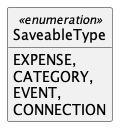

# Developer Guide

* [Acknowledgements](#acknowledgements)
* [Design](#design)
  * [Architecture](#architecture)
* [Implementation](#implementation)
  * [Category](#category)
  * [Summarising expenses](#summarising-expenses)
  * [Event](#event)
  * [Storage](#storage)
  * [UI](#ui)
* [Appendix: Requirements](#appendix-requirements)
  * [Product scope](#product-scope)
  * [User Stories](#user-stories)
  * [Use Cases](#use-cases)
  * [Non-Functional Requirements](#non-functional-requirements)
  * [Glossary](#glossary)
* [Appendix: Instructions for manual testing](#appendix-instructions-for-manual-testing)
  * [Testing loading of data](#testing-loading-of-data)
  * [Testing of viewing expenses](#testing-of-viewing-expenses)
  * [Testing of viewing categories](#testing-of-viewing-categories)
  * [Testing of viewing events](#testing-of-viewing-events)
  * [Testing of viewing expenses in events](#testing-of-viewing-expenses-in-events)
  * [Basic testing of summarising expenses](#basic-testing-of-summarising-expenses)
  * [Testing of cycling through command history](#testing-of-cycling-through-command-history)
  * [Testing of adding an expense](#testing-of-adding-an-expense)
  * [Testing of deleting an expense](#testing-of-deleting-an-expense)
  * [Testing of adding an event](#testing-of-adding-an-event)
  * [Testing of deleting an event](#testing-of-deleting-an-event)
  * [Testing of adding an expense to an event](#testing-of-adding-an-expense-to-an-event)
  * [Testing of deleting an expense from an event](#testing-of-deleting-an-expense-from-an-event)
  * [Testing of adding a category](#testing-of-adding-a-category)
  * [Testing of deleting a category](#testing-of-deleting-a-category)
* [Manual testing to get full coverage](#manual-testing-to-get-full-coverage)

## Acknowledgements

* [JLine](https://github.com/jline/jline3)

## Design

### Architecture
\
The **Architecture Diagram** given above explains the high-level design of the App.\
Given below is a quick overview of main components and how they interact with each other.

The manager classes of the application are:
- `UI`: This class is responsible for interacting with the user. It prints messages to the user and reads input from the user.
- `Logic`: This class coordinates the interaction between the `UI` and back-end classes. It processes user input into commands and executes them.
- `ExpenseManager`: This class is responsible for storing and managing the expenses.
- `EventManager`: This class is responsible for storing and managing the events.
- `EventExpenseManager`: This class is responsible for managing circular dependencies between events and expenses.
- `Dashboard`: This class is responsible for storing the managers classes of the application and providing access to them.
- `Category`: This class is responsible for storing the categories of expenses.
- `FileManager` class: This class is responsible for reading and writing data to files.

There are three main classes that store the data of the application:
- `Expense`: This class is responsible for storing the details of an expense.
- `Event`: This class is responsible for storing the details of an event.
- `Category`: This class is responsible for storing the categories of expenses.

There are several supporting classes that facilitate the interaction between the user and the application:
- `GeneralInputParser`: This class does the initial parsing of the user input and directs it to the appropriate parser.
- `GeneralFileParser`: This class parses the data in the files to recreate the expense and event objects.
- `Command`: This is an abstract class that represents a command that can be executed by the application. The commands are produced by the parser classes.

The following code snippet shows how the `GeneralInputParser` class is used to parse the user input:
```java
    public static Command getCommandFromUserInput(String userInput) {
        Command commandToExecute;
        try {
            String commandKeyword = userInput.split(" ")[0];
            String normalizedKeyword = commandKeyword.toLowerCase().trim();
            switch (normalizedKeyword) {
            case "add":
                commandToExecute = AddParser.parseInput(userInput);
                break;
            case "delete":
                commandToExecute = DeleteParser.parseInput(userInput);
                break;
            // Other cases omitted for brevity
            default:
                commandToExecute = new HelpCommand();
            }
        } catch (Exception e) {
            commandToExecute =  new HelpCommand();
        }
        return commandToExecute;
    }
```


To illustrate the flow of the application, the sequence diagram below shows how the user input is processed to add an expense:


Without loss of generality, the high-level execution flow of the application is as follows:
1. The user enters a command in the CLI
2. The `UI` class reads the user input and passes it to the `Logic` class
3. The `Logic` class uses the `GeneralInputParser` class to parse the user input 
4. The `GeneralInputParser` class directs the user input to the appropriate parser class
5. The parser class constructs a command object from the user input.
6. The `Logic` class executes the command object
7. The command object interacts with the relevant manager classes via the dashboard to perform the desired operation
8. The `UI` class prints feedback, if any, to the user

## Implementation
This section describes the implementation details of selected features of the Brokeculator application.

### Category
**Implementation** <br>
The category feature is mainly facilitated by the `Category` class. The `Category` class is responsible for storing the names of the categories present in expenses. 
In order for the user to be able to add expenses with a category, the category must be added using the `addCategory` method. 
The `addCategory` method takes in a string as a parameter and adds it to the set of categories.
The `Category` class implements the following operations:
- `addCategory(String category)` Adds a category to the set of categories
- `getCategoryListString()` Returns a string representation of the set of categories
- `removeCategory(String category)` Deletes a category from the set of categories

The `Category` class is supplemented by the following classes to interact with the user:
- `CategoryCommand` This class is responsible for handling and executing the commands related to categories 
- `CategoryParser` It is responsible for parsing the user input

The UML diagram below shows the main relationships between the classes in the category feature.

<br>
The Following sequence diagram shows how a user input is processed to add, delete or list the categories:

<br>
**User input category parsing sequence**
1. The user enters a command to add a category
2. The `CategoryParser` class parses the user input and returns a `CategoryCommand` object or an `InvalidCommand` object
depending on whether the user input is valid or not
3. The returned Command object is executed by the Logic Class (omitted in the diagram for brevity)
4. The appropriate method in the `Category` class is called to add the category, based on how the constructor
of the `CategoryCommand` object was called. result of the command would be returned from the `Category` class
to the `CategoryCommand` object, which would then be printed by the `UI` class to be viewed by the user (printing 
omitted from sequence diagram for brevity)

**Initialization** <br>
On startup, the `Category` class has its' set of categories loaded from the file `categories.txt` in the data folder.
This is facilitated by the `FileManager` and `GeneralFileParser` classes, with the `Logic` class serving as the main logic loop. 
The `GeneralFileParser` class reads the file and returns a list of strings.
The process is shown in the sequence diagram below:

In addition, at program initialisation, the function `setDashboard(dashboard: Dashboard)`
is called to set the dashboard object in the `Category` class.
This is to allow the `Category` class to access the `ExpenseManager` object stored in the `Dashboard` object.

### Summarising expenses
**Implementation** <br>
The expense summarising functionality is mainly facilitated by the `SummariseCommand`and `SummariseParser` classes. 
The `SummariseParser` class is responsible for constructing a `SummariseCommand` object from valid user input, which upon
execution would call the `summariseExpenses` method of the application's `ExpenseManager` object to obtain a summary of the expenses
currently tracked.

The following sequence diagram shows how user input is parsed to produce a summary of expenses in accordance with user
specifications:


**User input parsing sequence**
1. The user enters a command to summarise expenses, which is caught by the `UI` class and returned to the `Logic` class
2. The `Logic` class directs the user input to the `GeneralInputParser` class, which sees the `summarise` keyword
in the user input and directs it to the `SummariseParser` class
3. The `SummariseParser` class parses the user input and returns a `SummariseCommand` object or an `InvalidCommand` object 
depending on whether the user input is valid or not. A `SummariseCommand` object would store relevant information from
the user input in its private fields, whereas an `InvalidCommand` object would store an error message specifying the issues
of the user input
4. The `Logic` class calls the `execute(Dashboard dashboard)` method of the returned `Command` object
5. Upon execution, a `SummariseCommand` object would retrieve a reference to the `ExpenseManager` object stored within the 
`dashboard` and execute its `summariseExpenses` method, passing in its fields as parameters to the method call. This summarises
the expenses stored in the `ExpenseManager` object according to the user's specifications. The summary is then printed 
by the `UI` class to be viewed by the user
6. Executing an `InvalidCommand` object would instead have its error message printed by the `UI` class to be viewed by the user

### Event
**Implementation** <br>
The event feature aims to group expenses happening on specific occasions together. 
The `Event` class stores the details of the event and the list of expenses that are associated with the event.
The `EventManager` class is responsible for aggregate operations on the events.

The UMl diagram below shows the relationships between the classes in the event feature 
(irrelevant methods are omitted) <br>


The `EventExpenseManager` class mainly interacts with the `EventManager` and `ExpenseManager` classes 
via the `getExpense` and `getEvent` methods, 
which are used to retrieve event and expense objects at specific indexes. 
The connection between events and expenses should be managed through the `EventExpenseManager` class, 
which handles complexities such as circular dependencies between events and expenses.

Notably, the `EventExpenseManager` class also implements the following operations:
- `getConnectionsStringRepresentation()` Returns a string representation of all the connections between events and expenses for saving purposes
- `loadConnection(stringRepresentation : String)` Loads the connections between events and expenses from a string representation retrieved from the data file

It is possible to represent the connections between events and expenses using a dedicated `Connection` class. 
However, as the connections are frequently accessed and modified, 
it is more efficient to store the information directly in the expense and event objects.

The following sequence diagram show how a (valid) user input is processed by the `GeneralInputParser`
to create an `AddEventCommand`: <br>
 <br>

This sequence diagram shows how an `AddEventCommand` is then executed to create an `Event` and 
add it to the `EventManager`


**User input event main parsing sequence**
1. The user enters a command to add an event
2. The `EventParser` class parses the user input to identify the event name and the event description
3. The `AddEventCommand` object is created with the event name and description
4. When executed, the `AddEventCommand` object creates an `Event` object with the event name and description
5. The `AddEventCommand` object calls the `addEvent` method in the `EventManager` class to add the event created in step 4
6. Feedback is given to the user via the UI

The following sequence diagram shows the execution of an `AddExpenseToEventCommand` command object <br>


**Execution sequence of AddExpenseToEventCommand**
1. The command checks the validity of the event and expense indexes 
2. If the indexes are invalid, a feedback message is returned to the user
3. The event and expense objects are retrieved based on the indexes
4. If the expense already exists in the event, a feedback message is returned to the user
5. The original owning event of the expense is retrieved 
6. If the expense has an owning event, the expense is removed from the owning event. Note that this owning event is different from the event the expense is being added to, else the command execution would have been terminated in step 4
7. The expense is added to the new event, and its owning event is updated

### Storage
The saving of data is managed by `FileKeyword`, `GeneralFileParser` and `FileManager`. The `FileKeyword` class is responsible for identifying the type of data stored in a file, the `GeneralFileParser` class invokes the appropriate parser based on the type of data, and the `FileManager` class reads and writes data to files.

How other classes interact with `FileManager` to extract commands from file contents have been elaborated on in [Category](#category).
This section will focus on the representation of data in the files, how data is formatted and stored, and eventually retrieved from the files.

There are four types of data that can be stored in the files, represented by the `SaveableType` enumeration class: <br>


The `FileKeyword` class implements the following operations:
- `formatWithKeyword(SaveableType saveableType, String stringRepresentation)` Formats the data with the appropriate keyword
- `getSaveableType(String fileString)` Returns the `SaveableType` of the data stored in the file
- `removeKeyword(String fileString)` Returns the data in the file without the keyword

Without loss of generality, we will explain how data is stored in the files using the `Expense` class as an example.
1. The `Expense` class has a `getStringRepresentation()` method that returns a string representation of the expense object
2. When `Logic` class wants to save the expense object to a file, it calls the getExpensesStringRepresentation() method of the `ExpenseManager` class, which returns a string representation of all the expenses formatted with the `SaveableType.EXPENSE` keyword
3. The `FileManager` class writes the string representation to the file
4. When the application is started, the `GeneralFileParser` class reads the string representation from the file and deciphers the `SaveableType` using the `FileKeyword` class
5. The `GeneralFileParser` class then removes the keyword using the `FileKeyword` class and creates an `AddExpenseFromFileCommand` object with the original string representation as a parameter
6. The `AddExpenseFromFileCommand` object is executed, and the string representation is passed to the `Expens` class to create the `Expense` object

The following code snippet shows how the GeneralFileParser class is used to parse the data in the files:
```java
    public static Command getCommandFromFileInput(String fileString) {

        SaveableType saveableType = FileKeyword.getSaveableType(fileString);
        if (saveableType == null) {
            return new InvalidCommand("Corrupted entry: " + fileString);
        }
        String fileStringWithoutKeyword = FileKeyword.removeKeyword(fileString);
        switch (saveableType) {
        case EXPENSE:
            return new AddExpenseFromFileCommand(fileStringWithoutKeyword);
        case CATEGORY:
            return new AddCategoryFromFileCommand(fileStringWithoutKeyword);
        case EVENT:
            return new AddEventFromFileCommand(fileStringWithoutKeyword);
        case CONNECTION:
            return new AddConnectionFromFileCommand(fileStringWithoutKeyword);
        default:
            return new InvalidCommand("Corrupted entry: " + fileString);
        }
    }
```
Any data stored in the files should be registered with the `FileKeyword` class to ensure that the data can be correctly identified and parsed. It is worth mentioning that the `FileKeyword` does not modify the original data, but only returns a formatted string with the keyword.

### UI
**Implementation**\
The `UI` component of Brokeculator is designed to handle all user interactions for the application. The following section details the technical implementation of the `UI` module.

The `UI` class encapsulates the user interface logic of the application. It relies on the TerminalHandler class, which provides a layer of abstraction over the JLine library, to handle the specifics of terminal input and output.

**Terminal Handling**\
The TerminalHandler class is responsible for initializing and managing the terminal environment. TerminalHandler creates a Terminal object using JLine's TerminalBuilder, which is configured to support system-specific terminal features. It also instantiates a LineReader object, which is central to input operations, providing history support and sophisticated input processing, such as tab completion and masking.

```java
public class TerminalHandler {
    private Terminal terminal;
    private LineReader lineReader;

    public TerminalHandler() {
        try {
            terminal = TerminalBuilder.builder().system(true).build();
            lineReader = LineReaderBuilder.builder().terminal(terminal).build();
        } catch (Exception e) {
            Logger logger = Logger.getLogger(TerminalHandler.class.getName());
            logger.severe("Error creating terminal: " + e.getMessage());
            System.exit(1);
        }
    }
    // ... readLine, print, and println methods ...
}
```

**JLine Features**
1. The history feature in the `UI` allows users to navigate through their previous inputs using the `up` and `down` arrow keys. This feature is managed by the `LineReader` object within `TerminalHandler` and is a built-in capability provided by JLine. The history functionality is automatically enabled for the line reader, storing user inputs and allowing retrieval during the session.
2. The JLine library allows the user to edit their input using the arrow keys. This feature is enabled by default in the `LineReader` object and provides a familiar command-line interface experience for users.

## Appendix: Requirements

### Product scope

**Target user profile**

This project is designed to cater to the needs of university students who encounter the challenge of managing a myriad of expenses across various categories.
university students also do not have an extreme amount of expenses and a large budget to track, so having a simple CLI application to track expenses would be sufficient,
rather than a large scale application with a database management system.

**Value proposition**

Brokeculator is a CLI application designed for university students to log and view their expenses. 
As a CLI application, it allows for faster input of expenses compared to GUI applications, saving time, a 
valuable resource for university students. The application also allows for the categorization of expenses,
and classification of expenses into events, which is useful for students who need to track their spending habits.
The application also allows for the import and export of data from a CSV file, which is useful for students who use multiple devices,
but do not want to reveal their data via the internet.
For experienced CLI users, they can enter their expenses faster compared to GUI applications

### User Stories

|Version| As a ... | I want to ... | So that I can ...|\
| v1.0 | student | see a basic summary of my expenses to see how much i have spent in total | ------------------ |\
| v1.0 | student | view the expenses I have logged | know how much I have spent |\
| v1.0 | paranoid user | save my expenses into a file | backup locally via a file to prevent data loss |\
| v1.0 | student | have the ability to add expenses | ------------------ |\
| v1.0 | student | have the ability to delete expenses | remedy my erroneous expenses |\
| v1.0 | student who cares about privacy | track expenses offline | retain my privacy |\
| v2.0 | university student | retrieve spending based on time periods | track important spending days |\
| v2.0 | new user | see instructions on how to use the CLI commands| understand how to use the application |\
| v2.0 | student | search and filter expenses based on various criteria such as dates, keywords and categories | track my spending more accurately |\
| v2.0 | student frequently using excel | import/export existing data from spreadsheet/csv | record existing information |\
| v2.0 | student | log expenses based on their categories | manage my spending habits within each category |\
| v2.0 | university committee member | classify expenses in groups of events | check expenses of events organized |\

### Use Cases

For all use cases below, the System is `Brokeculator` and the Actor is the `user`, unless specified otherwise.

**Use case: Add a category**

**MSS**
1. User requests to add a category.
2. Brokeculator adds the category and shows a confirmation message.

**Use case ends.**

**Extensions**
- 2a. The category already exists.
  - 2a1. Brokeculator shows a category already exists message.
  - **Use case ends.**
- 2b. The input format is invalid.
  - 2b1. Brokeculator shows an invalid format message.
  - **Use case ends.**

**Use case: List categories**

**MSS**
1. User requests to list categories.
2. Brokeculator shows a list of categories.

**Use case ends.**

**Extensions**
- 2a. There are no categories to list.
  - 2a1. Brokeculator shows a message indicating no categories.
  - **Use case ends.**

**Use case: Delete a category**

**MSS**
1. User requests to delete a specific category.
2. Brokeculator deletes the category and shows a confirmation message.

**Use case ends.**

**Extensions**
- 2a. The category does not exist.
  - 2a1. Brokeculator shows a category does not exist message.
  - **Use case ends.**
- 2b. The category is associated with an expense.
  - 2b1. Brokeculator shows a message indicating the category is associated with an expense.
  - **Use case ends.**

**Use case: Add an expense**

**MSS**
1. User requests to add an expense with necessary details.
2. Brokeculator adds the expense and shows a confirmation message.

**Use case ends.**

**Extensions**
- 2a. The specified category does not exist.
  - 2a1. Brokeculator shows a category does not exist message.
  - **Use case ends.**
- 2b. The input format is invalid.
  - 2b1. Brokeculator shows an invalid format message.
  - **Use case ends.**

**Use case: List expenses**

**MSS**
1. User requests to list expenses starting from a specific index.
2. Brokeculator shows a list of expenses from the index.

**Use case ends.**

**Extensions**
- 2a. There are no expenses to list from the given index.
  - 2a1. Brokeculator shows a message indicating the list is empty.
  - **Use case ends.**

**Use case: Delete an expense**

**MSS**
1. User requests to delete an expense by index.
2. Brokeculator deletes the expense and shows a confirmation message.

**Use case ends.**

**Extensions**
- 2a. The specified index is invalid.
  - 2a1. Brokeculator shows an error message.
  - **Use case ends.**

**Use case: Summarise expenses**

**MSS**
1. User requests to summarise expenses with specific criteria.
2. Brokeculator calculates and shows the expense summary.

**Use case ends.**

**Extensions**
- 2a. The input format is invalid.
  - 2a1. Brokeculator shows an invalid format message.
  - **Use case ends.**

**Use case: Add an event**

**MSS**
1. User requests to add an event with a name and description.
2. Brokeculator adds the event and shows a confirmation message.

**Use case ends.**

**Extensions**
- 2a. The input format is invalid.
  - 2a1. Brokeculator shows an invalid format message.
  - **Use case ends.**

**Use case: List events**

**MSS**
1. User requests to list events.
2. Brokeculator shows a list of events.

**Use case ends.**

**Extensions**
- 2a. There are no events to list.
  - 2a1. Brokeculator shows a message indicating no events.
  - **Use case ends.**

**Use case: Delete an event**

**MSS**
1. User requests to delete an event by index.
2. Brokeculator deletes the event and shows a confirmation message.

**Use case ends.**

**Extensions**
- 2a. The specified index is invalid.
  - 2a1. Brokeculator shows an error message.
  - **Use case ends.**

**Use case: Add expense to event**

**MSS**
1. User requests to add an existing expense to an event using their respective indexes.
2. Brokeculator adds the expense to the event and shows a confirmation message.

**Use case ends.**

**Extensions**
- 2a. The specified expense or event index is invalid.
  - 2a1. Brokeculator shows an error message.
  - **Use case ends.**
- 2b. The expense is already associated with the event.
  - 2b1. Brokeculator shows a message indicating the expense is already associated with the event.
  - **Use case ends.**
- 2c. The expense is associated with another event.
  - 2c1. Brokeculator shows a message indicating the expense will be moved to the new event.
  - **Use case ends.**

**Use case: Delete expense from event**

**MSS**
1. User requests to delete an expense from an event using the expense index.
2. Brokeculator deletes the expense from the event and shows a confirmation message.

**Use case ends.**

**Extensions**
- 2a. The specified index is invalid.
  - 2a1. Brokeculator shows an error message.
  - **Use case ends.**

**Use case: List expenses in event**

**MSS**
1. User requests to view all expenses for a specific event by index.
2. Brokeculator lists all expenses associated with the event.

**Use case ends.**

**Extensions**
- 2a. The specified index is invalid.
  - 2a1. Brokeculator shows an error message.
  - **Use case ends.**
- 2b. There are no expenses for the given event.
  - 2b1. Brokeculator shows a message indicating the event has no associated expenses.
  - **Use case ends.**

### Non-Functional Requirements

1. **OS requirements**: The application should be able to run on any mainstream OS with Java 11 installed
2. **Performance**: The application should be able to handle user input without significant lag
3. **Reliability**: The application should be able to handle user input without crashing
4. **Usability**: The application should be easy to use for users familiar with CLI applications, instructions should be clear,
and what the application carried out based on user input should be clear to the user


### Glossary

* *mainstream OS* - Windows, Linux, MacOS

## Appendix: Instructions for manual testing

This section details how to do manual testing of the application. The following sections are to be followed in sequence to test the reliability of the application.

### Testing loading of data

All data files should reside in the data folder, in the directory that the user has launched the application from.
The following are to be done in sequence to test reliability of loading data:

**Loading of category data** <br>
In the data folder, create a file named `category.txt` and populate it with the following data:
```dtd
--category--CAT3
--category--CAT2
--category--CAT1
```

**Loading of expense data** <br>
In the data folder, create a file named `data.txt` and populate it with the following data:
```dtd
--expense--|__EXPENSE_DESCRIPTION__|:test1|__EXPENSE_DATE__|:12-12-2024|__EXPENSE_AMOUNT__|:16.00
--expense--|__EXPENSE_DESCRIPTION__|:test2|__EXPENSE_DATE__|:12-12-2024|__EXPENSE_AMOUNT__|:20.00|__EXPENSE_CATEGORY__|:CAT1
--expense--|__EXPENSE_DESCRIPTION__|:test3|__EXPENSE_DATE__|:12-01-2024|__EXPENSE_AMOUNT__|:100.00|__EXPENSE_CATEGORY__|:CAT3
```

**Loading of event data** <br>
In the data folder, create a file named `event.txt` and populate it with the following data:
```dtd
--event--|__EVENT_NAME__|:eventtest|__EVENT_DESCRIPTION__|:test 1
--event--|__EVENT_NAME__|:eventtest2|__EVENT_DESCRIPTION__|:test 2
--event--|__EVENT_NAME__|:eventtest3|__EVENT_DESCRIPTION__|:test 3
```

**Loading of event connections data** <br>
In the data folder, create a file named `connection.txt` and populate it with the following data:
```dtd
--connection--|__EXPENSE__|:1|__EVENT__|:1
--connection--|__EXPENSE__|:2|__EVENT__|:2
```

Start the application by running the `Brokeculator.jar` file in the same directory as the data file. 
The application should load the data from the files and the user should see the following:
```dtd
------------------------------------
Hello! I'm Brokeculator!
If this is your first time using me, type 'help' to see what I can do for you.
------------------------------------
    ->
```

### Testing of viewing expenses

The user should be able to view the expenses by typing `list` and pressing enter. The user should see the following:
```dtd
------------------------------------
1. test1 $16.00 (Thursday, 12 December 2024)
2. test2 $20.00 (Thursday, 12 December 2024) [CAT1]
3. test3 $100.00 (Friday, 12 January 2024) [CAT3]
------------------------------------
```

### Testing of viewing categories

The user should be able to view the categories by typing `category list` and pressing enter. The user should see the following:
```dtd
------------------------------------
Categories:
- CAT3
- CAT2
- CAT1
------------------------------------
```

### Testing of viewing events

The user should be able to view the events by typing `listEvents` and pressing enter. The user should see the following:
```dtd
------------------------------------
1. eventtest (test 1)
2. eventtest2 (test 2)
3. eventtest3 (test 3)
------------------------------------
```

### Testing of viewing expenses in events

The user should be able to view the expenses in the first event by typing `viewEvent /i 1` and pressing enter. The user should see the following:
```dtd
eventtest (test 1)
Event has 1 expenses:
test1 $16.00 (Thursday, 12 December 2024)
```
The user should be able to view the expenses in the second event by typing `viewEvent /i 2` and pressing enter. The user should see the following:
```dtd
------------------------------------
eventtest2 (test 2)
Event has 1 expenses:
test2 $20.00 (Thursday, 12 December 2024) [CAT1]
------------------------------------
```
The user should be able to view the expenses in the third event by typing `viewEvent /i 3` and pressing enter. The user should see
that there are no expenses in the event:
```dtd
------------------------------------
eventtest3 (test 3)
Event has no expenses
------------------------------------
```

### Basic testing of summarising expenses

The user should be able to summarise all the expenses by typing `summarise` and pressing enter. The user should see the following:
```dtd
------------------------------------
1. test1 $16.00 (Thursday, 12 December 2024)
2. test2 $20.00 (Thursday, 12 December 2024) [CAT1]
3. test3 $100.00 (Friday, 12 January 2024) [CAT3]
------------------------------------
------------------------------------
The total is $136.00
------------------------------------
```
The user can view the expenses on 12 Decmber 2024 by typing `summarise /start 12-12-2024 /end 12-12-2024` and pressing enter. The user should see the following:
```dtd
------------------------------------
1. test1 $16.00 (Thursday, 12 December 2024)
2. test2 $20.00 (Thursday, 12 December 2024) [CAT1]
------------------------------------
------------------------------------
The total is $36.00
------------------------------------
```
The user can view the expenses with descriptions starting with a 3 in it by typing `summarise /n 3` and pressing enter. The user should see the following:
```dtd
------------------------------------
1. test3 $100.00 (Friday, 12 January 2024) [CAT3]
------------------------------------
------------------------------------
The total is $100.00
------------------------------------
```
The rest of the summarise command options can be tested in a similar manner, by following the user guide.

### Testing of cycling through command history

The user should be able to navigate through the command history by pressing the up and down arrow keys. The user should be able to see the previous command by pressing the up arrow key and the next command entered by pressing the down arrow key.

### Testing of Adding an expense

The user should be able to add an expense by typing `add /n test4 /d 11-12-2024 /a 50.00 /c CAT2` and pressing enter. The user should see the following:
```dtd
------------------------------------
Added expense: test4 $50.00 (Wednesday, 11 December 2024) [CAT2]
------------------------------------
```
upon typing `list` and pressing enter, the user should see the following:
```dtd
------------------------------------
1. test1 $16.00 (Thursday, 12 December 2024)
2. test2 $20.00 (Thursday, 12 December 2024) [CAT1]
3. test3 $100.00 (Friday, 12 January 2024) [CAT3]
4. test4 $50.00 (Wednesday, 11 December 2024) [CAT2]
------------------------------------
```

### Testing of Deleting an expense

The user should be able to delete an expense by typing `delete /i 4` and pressing enter. The user should see the following:
```dtd
------------------------------------
Deleted expense at index 4
------------------------------------
```
upon typing `list` and pressing enter, the user should see the following:
```dtd
------------------------------------
1. test1 $16.00 (Thursday, 12 December 2024)
2. test2 $20.00 (Thursday, 12 December 2024) [CAT1]
3. test3 $100.00 (Friday, 12 January 2024) [CAT3]
------------------------------------
```

### Testing of Adding an event

The user should be able to add an event by typing `event /n eventtest4 /d test 4` and pressing enter. The user should see the following:
```dtd
------------------------------------
Event added successfully
------------------------------------
```
upon typing `listEvents` and pressing enter, the user should see the following:
```dtd
------------------------------------
1. eventtest (test 1)
2. eventtest2 (test 2)
3. eventtest3 (test 3)
4. eventtest4 (test 4)
------------------------------------
```

### Testing of Deleting an event

The user should be able to delete an event by typing `deleteEvent /i 4` and pressing enter. The user should see the following:
```dtd
------------------------------------
Event deleted
------------------------------------
```
upon typing `listEvents` and pressing enter, the user should see the following:
```dtd
------------------------------------
1. eventtest (test 1)
2. eventtest2 (test 2)
3. eventtest3 (test 3)
------------------------------------
```

### Testing of Adding an expense to an event

The user should be able to add an expense to an event by typing `addExEv /exi 3 /evi 3` and pressing enter. The user should see the following:
```dtd
------------------------------------
Expense added to event successfully
------------------------------------
```
upon typing `viewEvent /i 3` and pressing enter, the user should see the following:
```dtd
------------------------------------
eventtest3 (test 3)
Event has 1 expenses:
test3 $100.00 (Friday, 12 January 2024) [CAT3]
------------------------------------
```

### Testing of Deleting an expense from an event

The user should be able to delete an expense from an event by typing `delExEv /i 3` and pressing enter. The user should see the following:
```dtd
------------------------------------
Expense removed from event successfully
------------------------------------
```
upon typing `viewEvent /i 3` and pressing enter, the user should see the following:
```dtd
------------------------------------
eventtest3 (test 3)
Event has no expenses
------------------------------------
```

### Testing of adding a category

The user should be able to add a category by typing `category add CAT4` and pressing enter. The user should see the following:
```dtd
------------------------------------
Category added: CAT4
------------------------------------
```
upon typing `category list` and pressing enter, the user should see the following:
```dtd
------------------------------------
Categories:
- CAT4
- CAT3
- CAT2
- CAT1
------------------------------------
```

### Testing of deleting a category

The user should be able to delete a category by typing `category delete CAT4` and pressing enter. The user should see
the following:
```dtd
------------------------------------
Category removed: CAT4
------------------------------------
```
upon typing `category list` and pressing enter, the user should see the following:
```dtd
------------------------------------
Categories:
- CAT3
- CAT2
- CAT1
------------------------------------
```

## Manual testing to get full coverage
The above tests are not exhaustive and are meant to be a guide to test the application. 
To conduct more tests, the user should refer to the user guide and test all the commands and options available in the application.
